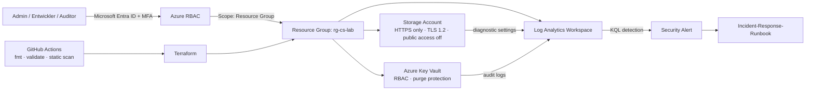

# Sicherheitsarchitektur: Secure Azure Workload Lab

Dieses Repository demonstriert eine **sichere, klein gehaltene Azure-Workload** für ein Bewerbungsportfolio. Es ist bewusst als Labor konzipiert: Es enthält keine echten Zugangsdaten, keine Kundendaten und keine produktiven Identitäten. Die technische Idee ist eine statische Web-Workload in einem Storage Account, geschützt durch Netzwerksegmentierung, rollenbasierte Rechte, Key Vault, Monitoring und nachvollziehbare Incident-Response-Artefakte.

> **Portfolio-Aussage:** Ich kann eine Cloud-Workload nicht nur bereitstellen, sondern Sicherheitskontrollen als Code definieren, Rechte begrenzen, relevante Ereignisse auswerten und einen Vorfall strukturiert behandeln.

## Architekturübersicht

## Schutzbedarf und Kontrollen

| Schutzbereich | Risiko im Lab | Implementierte Kontrolle | Nachweis im Repository |
|---|---|---|---|
| Identität | Zu weitreichende Berechtigungen | Drei klar getrennte Personas, Gruppen-basierte Rollen und Scope auf Resource Group | `docs/02_iam_matrix.md`, `terraform/iam.tf` |
| Geheimnisse | Klartext- oder langlebige Credentials | Key Vault mit RBAC, Soft Delete und Purge Protection; keine Secrets im Code | `terraform/main.tf`, `.gitignore` |
| Netzwerk | Öffentliche bzw. unverschlüsselte Zugriffe | HTTPS only, TLS mindestens 1.2, Public Blob Access deaktiviert, öffentliche Netzwerkfreigabe im Lab aus | `terraform/main.tf` |
| Nachvollziehbarkeit | Sicherheitsrelevante Aktionen bleiben unentdeckt | Diagnostik an Log Analytics, KQL-Abfragen und Log-Analyzer für simulierte Entra-Anmeldungen | `terraform/monitoring.tf`, `docs/04_detection_queries.kql`, `scripts/analyze_signins.py` |
| Reaktion | Uneinheitlicher Umgang mit Alarmen | Triage-, Containment-, Recovery- und Lessons-Learned-Runbook | `docs/05_incident_response.md` |
| Änderungsmanagement | Manuelle oder unprüfbare Infrastrukturänderungen | Terraform, Pull-Request-Checks und keine Secrets in CI | `.github/workflows/terraform.yml`, `terraform/` |

## Annahmen und Grenzen

Das Lab setzt eine vorhandene Azure Subscription, einen angemeldeten Azure-CLI-Kontext, Terraform sowie die Objekt-IDs dreier **Testgruppen** in Microsoft Entra ID voraus. Es erzeugt absichtlich **keine** Entra-Gruppen und keine Conditional-Access- oder MFA-Policies, weil diese in der Regel Tenant-Rechte und gegebenenfalls Lizenzierung voraussetzen. Das dokumentierte Zielbild erläutert jedoch, wie solche Kontrollen in einer echten Umgebung ergänzt würden.

Ein Storage Account mit deaktiviertem öffentlichem Netzwerkzugriff eignet sich als sichere Konfigurationsübung. Eine tatsächlich erreichbare Web-App würde in einer nächsten Ausbaustufe über ein VNet, Private Endpoint und einen kontrollierten Ingress (z. B. Front Door oder Application Gateway) angebunden. Damit bleibt der Sicherheitsanspruch des Labs ehrlich: **Es ist eine demonstrierbare Sicherheitsbasis, keine behauptete Produktionsfreigabe.**

## Architekturentscheidungen

| Entscheidung | Begründung |
|---|---|
| **RBAC statt individueller Direktzuweisungen** | Gruppenbasierte Zuweisungen sind administrativ nachvollziehbarer. Die Rollen werden auf die Resource Group begrenzt statt auf Subscription-Ebene vergeben. |
| **Kein Owner für Entwickler** | Der Entwickler erhält `Contributor` auf Resource-Group-Scope, aber keine Möglichkeit, Rollen zu vergeben. Das reduziert die Gefahr einer Privilege Escalation. |
| **Key Vault mit RBAC und Schutz vor endgültigem Löschen** | Der Vault wird mit RBAC-Autorisierung, Soft Delete und Purge Protection angelegt. Microsoft empfiehlt Least Privilege sowie diese Schutzmechanismen für sensible kryptografische Materialien.[1] |
| **Diagnostik in Log Analytics** | Resource Logs werden über Diagnostic Settings in einen Workspace gesendet und können dort mit KQL abgefragt und alarmiert werden.[2] |
| **Infrastruktur als Code** | Konfiguration wird reviewbar und reproduzierbar. CI prüft Syntax/Validierung vor dem Zusammenführen. |

## Verweise

[1] [Microsoft Learn: Secure your Azure Key Vault](https://learn.microsoft.com/en-us/azure/key-vault/general/secure-key-vault)

[2] [Microsoft Learn: Diagnostic settings in Azure Monitor](https://learn.microsoft.com/en-us/azure/azure-monitor/platform/diagnostic-settings)

[3] [Microsoft Learn: Best practices for Azure RBAC](https://learn.microsoft.com/en-us/azure/role-based-access-control/best-practices)

---

**Wichtig:** Dieses Projekt ist ein Ausbildungs- und Portfolio-Lab. Vor einem produktiven Einsatz müssen Architektur, Datenschutz, Kosten, organisatorische Rollen, Netzwerkanbindung und die konkrete Azure-Policy-Landschaft überprüft werden.
